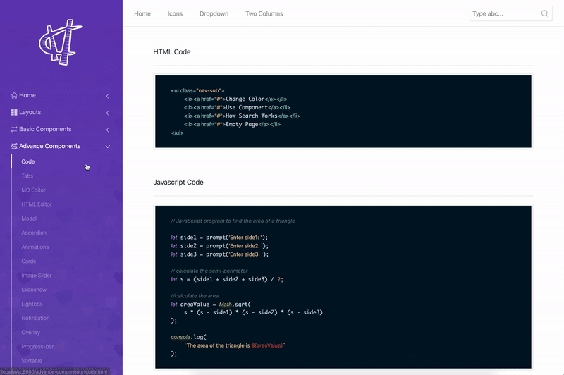
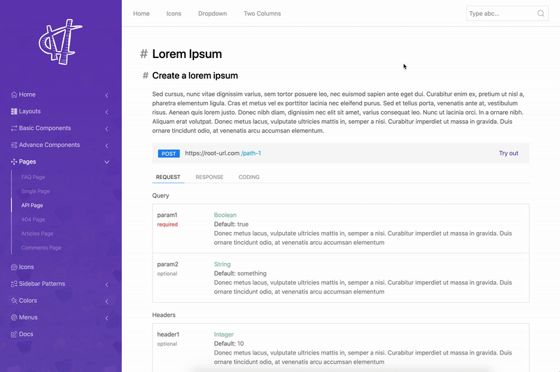
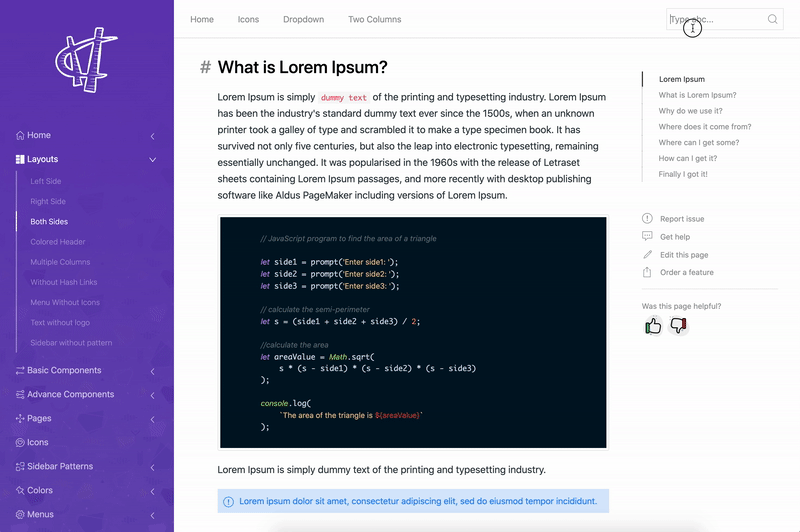
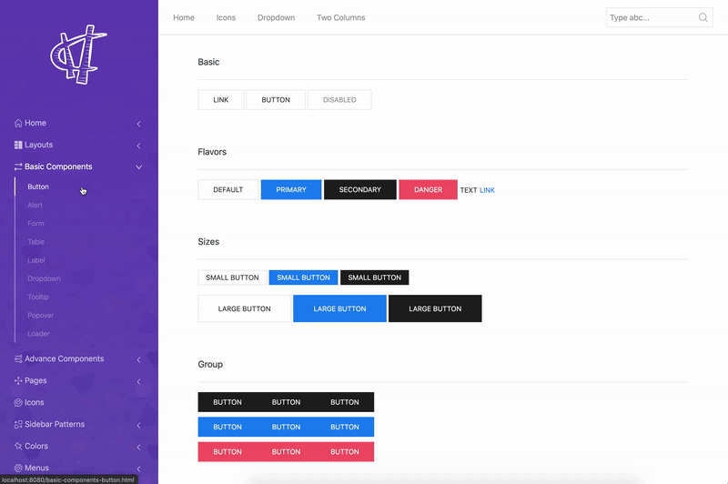

# ZamaDoc - HTML5 Documentation Template

**ZamaDoc** is a modern & responsive HTML5 documentation template. The idea of **ZamaDoc** started when I was in the struggle of finding a good HTML5 documentation template for one of my open-source project. I didn't find any suitable template. So, I started creating one by myself and ended up with **ZamaDoc**. It's based on **UIKit**, **HTML5**, **CSS3** & JavaScript (**ES6**). **Tested** on almost all of the modern devices and browsers with **BrowserStack**.

## Docs
[Link to docs](https://asfand-dev.github.io/html-documentation-template)

## Demo
[Link to demo](https://asfand-dev.github.io/html-documentation-template/home-light.html)

## Screenshots

### Home page

### Home-dark page

### Advance components page

### API page

### Mobile View

### Search page

### Basic components page

